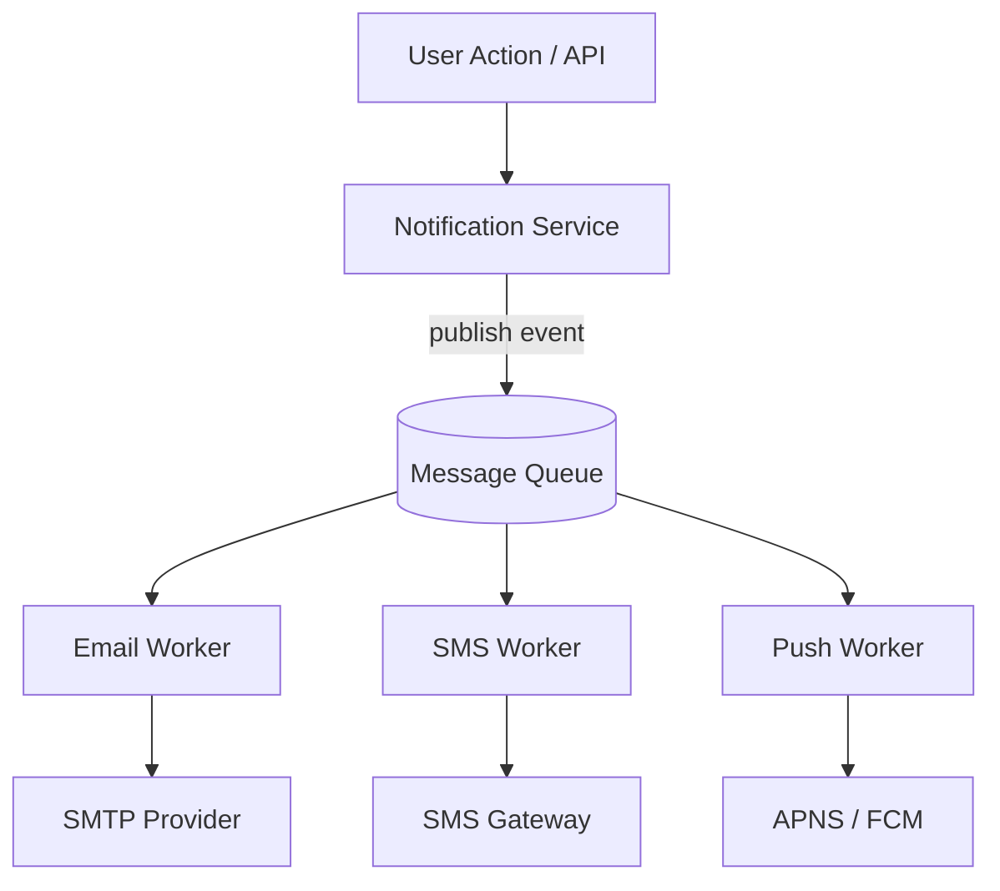
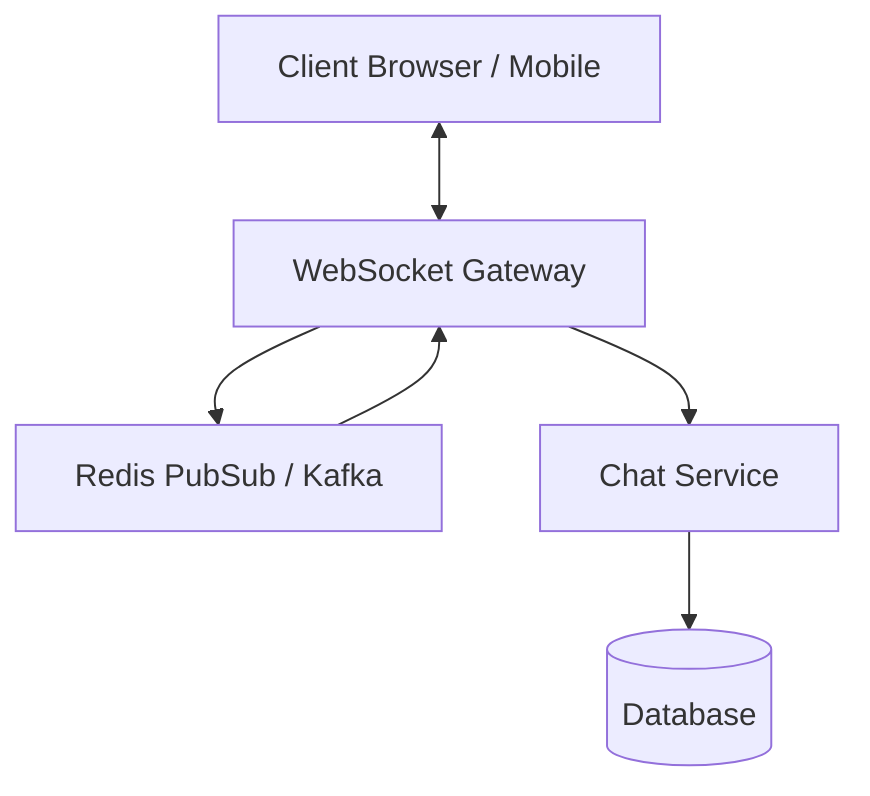
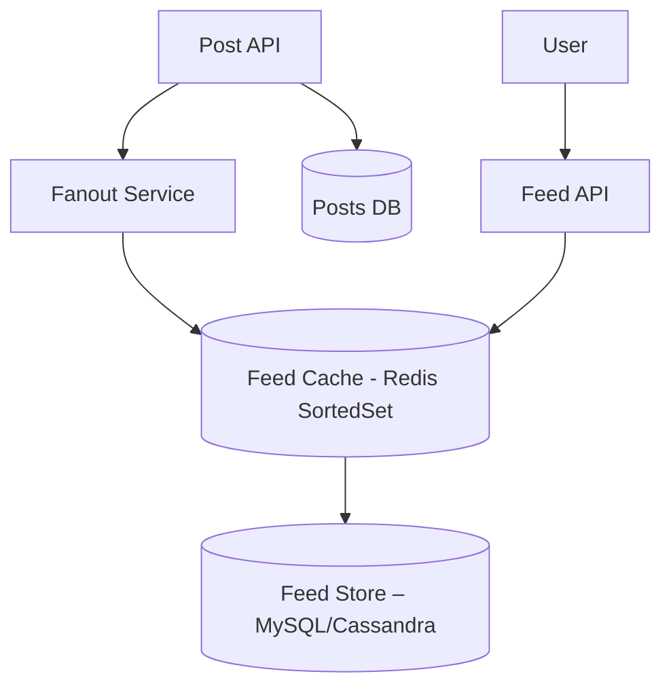

## 🏗️ System Design & Architecture (Rapid Revision)

### 🔸 Monolith vs Modular Monolith vs Microservices

| Aspect        | Monolith                  | Modular Monolith               | Microservices                         |
| ------------- | ------------------------- | ------------------------------ | ------------------------------------- |
| Deployment    | Single unit               | Single unit, modularized       | Independently deployable services     |
| Communication | In-process calls          | In-process                     | Network calls (REST/gRPC/events)      |
| Scaling       | Vertical                  | Vertical or partial horizontal | Horizontal per service                |
| Pros          | Fast dev, easy testing    | Evolvable, better modularity   | Team ownership, independent scaling   |
| Cons          | Tight coupling, tech debt | Complexity inside boundaries   | Operational overhead, network latency |

👉 **Tip**: *Start modular monolith → evolve to microservices once needed.*

---

### 🔸 Hexagonal / Clean Architecture

- **Core domain isolated** from frameworks/databases.
- `Ports` (interfaces) and `Adapters` (implementations).
- Easy to test, swap infrastructure (SQL, NoSQL, MQ).

---

### 🔸 CQRS & Event Sourcing

| Concept    | CQRS                                 | Event Sourcing                       |
| ---------- | ------------------------------------ | ------------------------------------ |
| Usage      | Split commands vs queries            | Store events instead of latest state |
| Read Model | Optimized separately                 | Built by replaying events            |
| Pro        | Performance, scaling, clearer models | Auditable history, temporal queries  |
| Con        | Eventual consistency complexity      | Requires rebuilding state            |

---

### 🔸 SAGA – Distributed Transactions

- Coordinates multiple service actions **without DB transactions**.
- **Orchestration**: central controller → easy to reason.
- **Choreography**: event-based → scalable, harder to debug.

---

### 🔸 CAP & PACELC Theorem

- **CAP** → cannot have *Consistency*, *Availability*, *Partition-tolerance* all three.
  - Example: Cassandra → AP, PostgreSQL → CP.
- **PACELC** extends CAP:
  - *If partitioned*: choose **A**vailability vs **C**onsistency
  - *Else*: choose **L**atency vs **C**onsistency

---

### 🔸 API Gateway & BFF Pattern

- **Gateway** handles routing, auth, aggregation.
- **BFF** (Backend-For-Frontend): custom gateway per client (mobile/web) → improves performance & autonomy.

---

## ⚙️ 🔁 Messaging & Asynchronous Communication

### RabbitMQ vs Kafka (High-level)

| Feature   | RabbitMQ                | Kafka                              |
| --------- | ----------------------- | ---------------------------------- |
| Model     | Queuing broker          | Distributed commit log             |
| Ordering  | Queue-based             | Partition-based                    |
| Use-cases | Work queues, RPC jobs   | Event streams, analytics pipelines |
| Delivery  | At-most / at-least once | Exactly-once with transactions     |

---

### 🛠️ Backpressure / Consumer Scaling Tips

- RabbitMQ: use competing consumers, QoS (`prefetch`) flags.
- Kafka: scale by **adding partitions** + consumers in group.

---

### 🏗️ Use case examples

#### B. Notification System (Email/SMS/Push)

Modern systems send notifications asynchronously so the user doesn’t wait for delivery during API calls.

**Key Requirements**
- Multiple channels: email / SMS / push
- Retry logic + dead-letter queue
- High throughput, idempotency
- Decoupled producers & consumers

##### Architecture

**Notes**
- Use Kafka or RabbitMQ for queue
- Workers are stateless and horizontally scalable
- Store status “PENDING / SENT / FAILED”
- Use idempotency keys to prevent double send on retries

---

#### C. Real-Time Chat System (WebSockets)

**Requirements**
- Low latency bidirectional messaging
- Scalable fan-out
- Presence indication
- Message persistence

##### Architecture

**Highlights**
- Gateway must be stateless → use Pub/Sub to relay messages across instances
- Ping/pong heartbeats to detect dead sockets
- Store message history in SQL/NoSQL
- Shard chat by room/user with consistent hashing
- Optionally switch to gRPC + HTTP/2 for mobile battery optimization

---

#### D. Social Media News-Feed System

**Challenges**
- Each user follows thousands of others
- Feed should be sorted by recency + relevance
- Low-latency (<200 ms) reads
- Hot accounts (celebs) broadcast to millions

##### Architecture

##### Fan-out Strategies

| Approach         | When used    | Pros             | Cons                           |
| ---------------- | ------------ | ---------------- | ------------------------------ |
| Fan-out-on-write | Normal users | Fast feed reads  | Slow writes for celebs         |
| Fan-out-on-read  | Celebrities  | Writes are cheap | Read becomes slow / heavier DB |
| Hybrid           | Combination  | Balance          | Complexity in decision logic   |

**Optimizations**
- Redis SortedSets for timeline cache
- Batch DB writes from fanout workers
- Use ML/relevancy scoring pipeline asynchronously
- ✨ Eventual consistency accepted (feeds don’t need perfectly real-time)

---

### 🔎 Common Interview Questions (System Design)

**Q: How would you break a monolith into microservices gradually?**  
A: Start by identifying bounded contexts or modules within the monolith (e.g. billing, notifications). Extract their logic behind well-defined APIs while keeping the deployment monolithic. Then gradually move each module into its own service using techniques like the *strangler pattern* — route new traffic to the service, but fall back to monolith for legacy. Important steps include decoupling database access (using APIs or CDC), ensuring backwards compatibility, and adding infrastructure (service discovery, gateway, monitoring).

---

**Q: Explain SAGA choreography with a real example.**  
A: In SAGA choreography there is *no central coordinator*. Each participant listens for events and emits the next event after it completes its local transaction. For example, in an order workflow:  
1) `Order Created` → Inventory service consumes and reserves stock, then publishes `Stock Reserved`.  
2) Payment service listens to `Stock Reserved`, attempts to charge, emits `Payment Successful`.  
3) Shipping listens to that and creates a shipment.  
If any step fails, compensating events are emitted. This is scalable and loosely coupled, but harder to trace and reason about.

---

**Q: In what cases is eventual consistency acceptable?**  
A: When the system doesn’t need every replica to reflect changes immediately — only *eventual correctness*. Social feeds, user notifications, metrics dashboards, and log systems typically tolerate eventual consistency. It allows higher availability and faster writes at the cost of users potentially seeing slightly stale data.

---

**Q: What’s the difference between CQRS and Event Sourcing?**  
A: **CQRS** splits reads and writes — write side runs commands that mutate state, read side is optimized for queries. **Event Sourcing** is about storing state as a sequence of immutable events instead of latest snapshot. You can use Event Sourcing *with* CQRS on the write side (commands → events) but CQRS can also be used without Event Sourcing (commands update tables directly).

---

**Q: How would you design an async file upload → virus-scan → notification system?**  
A: Client uploads file → returns immediately with file ID. API publishes event/message to a queue. Virus-scan worker consumes from queue, processes the file, publishes result event back (e.g., “CLEAN” or “INFECTED”). Notification service subscribes and informs user. Entire process is decoupled with at-least-once queue semantics and DLQs; persistence layer stores file and scan status. This keeps upload responsive and hides the heavy work behind async workers.

---

**Q: What does PACELC add on top of CAP theorem?**  
A: CAP only describes trade-offs *in the face of a network partition*. PACELC says: *If there is a Partition → choose between Availability or Consistency; Else (normal operation) → choose between Latency or Consistency*. It models real systems better by acknowledging that even without failure, architects often accept weaker consistency in exchange for faster response times (e.g., DynamoDB & Cassandra are PA/EL).

---
